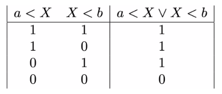

# Negating propositions involving or

Now that you understand how to negate a proposition involving and it stands to reason that the next thing we are going to learn in this task is how to negate a proposition involving or.  As we did for the logical conjunction lets start the process of learning to negate the logical disjunction by looking at the truth table for the logical disjunction once more:

Given that the negation of a proposition is the proposition that is true whenever the original proposition is false.  The truth table for the negation for the logical proposition involving the logical disjunction operator above must be:

 in another way if you start from the negations of the two proposition from which the compound proposition was formed is the key to solving this exercise.__
